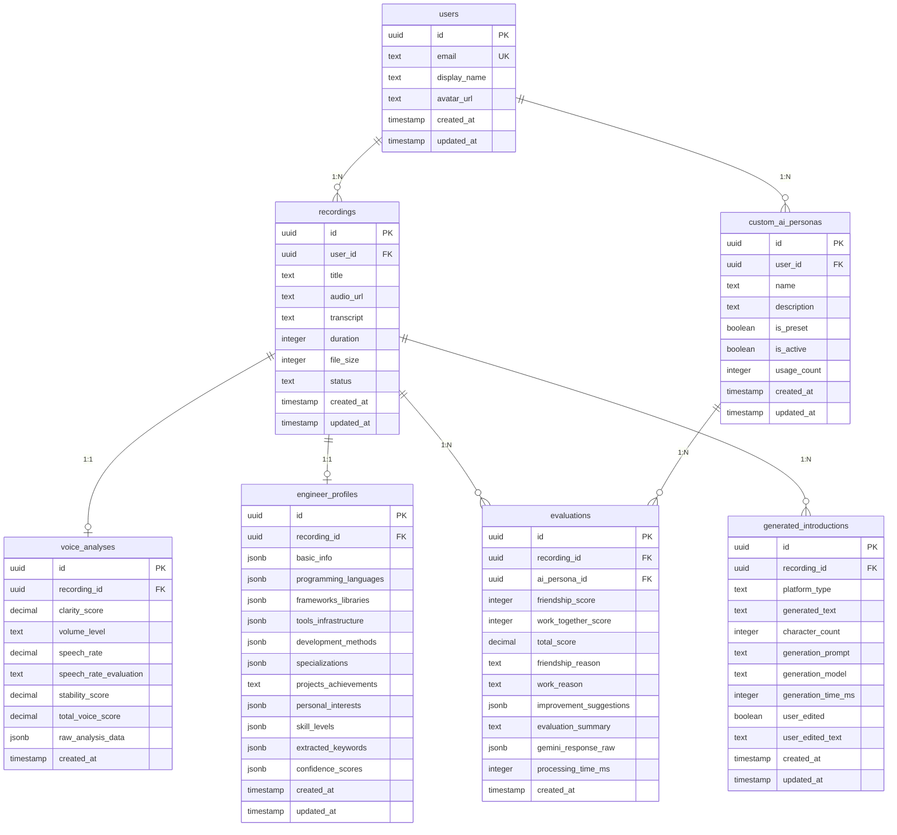

# intro-score データモデル設計

## 1. データベース概要

### 1.1 使用技術
- **データベース**: PostgreSQL (Supabase)
- **ORM**: Supabase Client / SQL
- **認証**: Supabase Auth

### 1.2 設計方針
- **正規化**: 第3正規形まで適用
- **パフォーマンス**: 適切なインデックス設定
- **セキュリティ**: Row Level Security (RLS) の活用
- **スケーラビリティ**: 将来の機能拡張を考慮した柔軟な設計

## 2. テーブル設計

### 2.1 users（ユーザー）

#### 概要
アプリケーションを利用するユーザーの基本情報を管理

#### テーブル定義
```sql
CREATE TABLE users (
    id UUID DEFAULT gen_random_uuid() PRIMARY KEY,
    email TEXT UNIQUE NOT NULL,
    display_name TEXT,
    avatar_url TEXT,
    created_at TIMESTAMP WITH TIME ZONE DEFAULT TIMEZONE('utc'::text, NOW()) NOT NULL,
    updated_at TIMESTAMP WITH TIME ZONE DEFAULT TIMEZONE('utc'::text, NOW()) NOT NULL
);
```

#### フィールド詳細
| フィールド名 | 型 | NULL | 説明 |
|-------------|-----|------|------|
| id | UUID | NO | ユーザー固有ID（主キー） |
| email | TEXT | NO | メールアドレス（一意制約） |
| display_name | TEXT | YES | 表示名 |
| avatar_url | TEXT | YES | アバター画像URL |
| created_at | TIMESTAMP | NO | 作成日時 |
| updated_at | TIMESTAMP | NO | 更新日時 |

#### インデックス
- PRIMARY KEY: id
- UNIQUE INDEX: email

### 2.2 recordings（録音データ）

#### 概要
ユーザーの音声録音データと文字起こし結果を管理

#### テーブル定義
```sql
CREATE TABLE recordings (
    id UUID DEFAULT gen_random_uuid() PRIMARY KEY,
    user_id UUID NOT NULL REFERENCES users(id) ON DELETE CASCADE,
    title TEXT DEFAULT '自己紹介録音',
    audio_url TEXT,
    transcript TEXT,
    duration INTEGER, -- 秒単位
    file_size INTEGER, -- バイト単位
    status TEXT CHECK (status IN ('recording', 'processing', 'completed', 'error')) DEFAULT 'recording',
    created_at TIMESTAMP WITH TIME ZONE DEFAULT TIMEZONE('utc'::text, NOW()) NOT NULL,
    updated_at TIMESTAMP WITH TIME ZONE DEFAULT TIMEZONE('utc'::text, NOW()) NOT NULL
);
```

#### フィールド詳細
| フィールド名 | 型 | NULL | 説明 |
|-------------|-----|------|------|
| id | UUID | NO | 録音データ固有ID（主キー） |
| user_id | UUID | NO | ユーザーID（外部キー） |
| title | TEXT | YES | 録音タイトル |
| audio_url | TEXT | YES | 音声ファイルURL（Supabase Storage） |
| transcript | TEXT | YES | 文字起こしテキスト |
| duration | INTEGER | YES | 録音時間（秒） |
| file_size | INTEGER | YES | ファイルサイズ（バイト） |
| status | TEXT | NO | 処理状況 |
| created_at | TIMESTAMP | NO | 作成日時 |
| updated_at | TIMESTAMP | NO | 更新日時 |

#### インデックス
- PRIMARY KEY: id
- INDEX: user_id
- INDEX: created_at

### 2.3 custom_ai_personas（カスタムAI人格）

#### 概要
ユーザーが作成したカスタムAI人格とプリセット人格を管理

#### テーブル定義
```sql
CREATE TABLE custom_ai_personas (
    id UUID DEFAULT gen_random_uuid() PRIMARY KEY,
    user_id UUID REFERENCES users(id) ON DELETE CASCADE,
    name TEXT NOT NULL,
    description TEXT NOT NULL,
    is_preset BOOLEAN DEFAULT FALSE,
    is_active BOOLEAN DEFAULT TRUE,
    usage_count INTEGER DEFAULT 0,
    created_at TIMESTAMP WITH TIME ZONE DEFAULT TIMEZONE('utc'::text, NOW()) NOT NULL,
    updated_at TIMESTAMP WITH TIME ZONE DEFAULT TIMEZONE('utc'::text, NOW()) NOT NULL
);
```

#### フィールド詳細
| フィールド名 | 型 | NULL | 説明 |
|-------------|-----|------|------|
| id | UUID | NO | AI人格固有ID（主キー） |
| user_id | UUID | YES | ユーザーID（プリセットの場合はNULL） |
| name | TEXT | NO | AI人格名 |
| description | TEXT | NO | AI人格の設定説明 |
| is_preset | BOOLEAN | NO | プリセット人格フラグ |
| is_active | BOOLEAN | NO | 利用可能フラグ |
| usage_count | INTEGER | NO | 利用回数 |
| created_at | TIMESTAMP | NO | 作成日時 |
| updated_at | TIMESTAMP | NO | 更新日時 |

#### インデックス
- PRIMARY KEY: id
- INDEX: user_id
- INDEX: is_preset

### 2.4 voice_analyses（音響分析結果）

#### 概要
Web Audio APIによる音響分析の結果データを管理

#### テーブル定義
```sql
CREATE TABLE voice_analyses (
    id UUID DEFAULT gen_random_uuid() PRIMARY KEY,
    recording_id UUID NOT NULL REFERENCES recordings(id) ON DELETE CASCADE,
    clarity_score DECIMAL(3,2) CHECK (clarity_score >= 0 AND clarity_score <= 10), -- 聞き取りやすさ
    volume_level TEXT CHECK (volume_level IN ('適切', '大きすぎる', '小さすぎる')), -- 音量
    speech_rate DECIMAL(5,2), -- 話速（文字/分）
    speech_rate_evaluation TEXT CHECK (speech_rate_evaluation IN ('適切', '早すぎる', '遅すぎる')),
    stability_score DECIMAL(3,2) CHECK (stability_score >= 0 AND stability_score <= 10), -- 声の安定性
    total_voice_score DECIMAL(5,2), -- 声質総合スコア
    raw_analysis_data JSONB, -- 生の分析データ
    created_at TIMESTAMP WITH TIME ZONE DEFAULT TIMEZONE('utc'::text, NOW()) NOT NULL
);
```

#### フィールド詳細
| フィールド名 | 型 | NULL | 説明 |
|-------------|-----|------|------|
| id | UUID | NO | 分析結果固有ID（主キー） |
| recording_id | UUID | NO | 録音データID（外部キー） |
| clarity_score | DECIMAL(3,2) | YES | 聞き取りやすさ（0-10点） |
| volume_level | TEXT | YES | 音量レベル |
| speech_rate | DECIMAL(5,2) | YES | 話速（文字/分） |
| speech_rate_evaluation | TEXT | YES | 話速の評価 |
| stability_score | DECIMAL(3,2) | YES | 声の安定性（0-10点） |
| total_voice_score | DECIMAL(5,2) | YES | 声質総合スコア |
| raw_analysis_data | JSONB | YES | 詳細分析データ |
| created_at | TIMESTAMP | NO | 分析実行日時 |

#### インデックス
- PRIMARY KEY: id
- UNIQUE INDEX: recording_id（1:1関係）

### 2.5 evaluations（AI評価結果）

#### 概要
AI人格による自己紹介の評価結果を管理

#### テーブル定義
```sql
CREATE TABLE evaluations (
    id UUID DEFAULT gen_random_uuid() PRIMARY KEY,
    recording_id UUID NOT NULL REFERENCES recordings(id) ON DELETE CASCADE,
    ai_persona_id UUID NOT NULL REFERENCES custom_ai_personas(id) ON DELETE RESTRICT,
    friendship_score INTEGER CHECK (friendship_score >= 1 AND friendship_score <= 100), -- 仲良くなりたい度
    work_together_score INTEGER CHECK (work_together_score >= 1 AND work_together_score <= 100), -- 一緒に働きたい度
    total_score DECIMAL(5,2), -- 最終統合スコア
    friendship_reason TEXT, -- 仲良くなりたい度の理由
    work_reason TEXT, -- 一緒に働きたい度の理由
    improvement_suggestions JSONB, -- 改善提案（配列）
    evaluation_summary TEXT, -- 評価サマリー
    gemini_response_raw JSONB, -- Gemini APIの生レスポンス
    processing_time_ms INTEGER, -- 処理時間（ミリ秒）
    created_at TIMESTAMP WITH TIME ZONE DEFAULT TIMEZONE('utc'::text, NOW()) NOT NULL
);
```

#### フィールド詳細
| フィールド名 | 型 | NULL | 説明 |
|-------------|-----|------|------|
| id | UUID | NO | 評価結果固有ID（主キー） |
| recording_id | UUID | NO | 録音データID（外部キー） |
| ai_persona_id | UUID | NO | AI人格ID（外部キー） |
| friendship_score | INTEGER | YES | 仲良くなりたい度（1-100点） |
| work_together_score | INTEGER | YES | 一緒に働きたい度（1-100点） |
| total_score | DECIMAL(5,2) | YES | 最終統合スコア |
| friendship_reason | TEXT | YES | 仲良くなりたい度の理由 |
| work_reason | TEXT | YES | 一緒に働きたい度の理由 |
| improvement_suggestions | JSONB | YES | 改善提案配列 |
| evaluation_summary | TEXT | YES | 評価の総合サマリー |
| gemini_response_raw | JSONB | YES | API生レスポンス保存 |
| processing_time_ms | INTEGER | YES | 処理時間測定 |
| created_at | TIMESTAMP | NO | 評価実行日時 |

#### インデックス
- PRIMARY KEY: id
- INDEX: recording_id
- INDEX: ai_persona_id
- INDEX: created_at

### 2.6 engineer_profiles（エンジニアプロフィール）

#### 概要
自己紹介から抽出されたエンジニア固有の情報を管理

#### テーブル定義
```sql
CREATE TABLE engineer_profiles (
    id UUID DEFAULT gen_random_uuid() PRIMARY KEY,
    recording_id UUID NOT NULL REFERENCES recordings(id) ON DELETE CASCADE,
    basic_info JSONB, -- 基本情報 {name, experience_years, position, team}
    programming_languages JSONB, -- プログラミング言語 ["JavaScript", "Python", ...]
    frameworks_libraries JSONB, -- フレームワーク・ライブラリ ["React", "Django", ...]
    tools_infrastructure JSONB, -- ツール・インフラ ["AWS", "Docker", ...]
    development_methods JSONB, -- 開発手法 ["Agile", "CI/CD", ...]
    specializations JSONB, -- 専門領域 ["Frontend", "Backend", ...]
    projects_achievements TEXT, -- プロジェクト・実績
    personal_interests JSONB, -- 個人的興味 {hobbies: [...], other_skills: [...]}
    skill_levels JSONB, -- スキルレベル推定 {language: "intermediate", ...}
    extracted_keywords JSONB, -- 抽出されたキーワード
    confidence_scores JSONB, -- 抽出結果の信頼度
    created_at TIMESTAMP WITH TIME ZONE DEFAULT TIMEZONE('utc'::text, NOW()) NOT NULL,
    updated_at TIMESTAMP WITH TIME ZONE DEFAULT TIMEZONE('utc'::text, NOW()) NOT NULL
);
```

#### フィールド詳細
| フィールド名 | 型 | NULL | 説明 |
|-------------|-----|------|------|
| id | UUID | NO | プロフィール固有ID（主キー） |
| recording_id | UUID | NO | 録音データID（外部キー） |
| basic_info | JSONB | YES | 基本情報オブジェクト |
| programming_languages | JSONB | YES | プログラミング言語配列 |
| frameworks_libraries | JSONB | YES | フレームワーク配列 |
| tools_infrastructure | JSONB | YES | ツール・インフラ配列 |
| development_methods | JSONB | YES | 開発手法配列 |
| specializations | JSONB | YES | 専門領域配列 |
| projects_achievements | TEXT | YES | プロジェクト実績テキスト |
| personal_interests | JSONB | YES | 個人的興味オブジェクト |
| skill_levels | JSONB | YES | スキルレベル推定 |
| extracted_keywords | JSONB | YES | 抽出キーワード配列 |
| confidence_scores | JSONB | YES | 各抽出結果の信頼度 |
| created_at | TIMESTAMP | NO | 作成日時 |
| updated_at | TIMESTAMP | NO | 更新日時 |

#### インデックス
- PRIMARY KEY: id
- UNIQUE INDEX: recording_id（1:1関係）
- GIN INDEX: programming_languages, frameworks_libraries（JSON検索用）

### 2.7 generated_introductions（生成された自己紹介）

#### 概要
AI生成された各プラットフォーム向けの自己紹介文を管理

#### テーブル定義
```sql
CREATE TABLE generated_introductions (
    id UUID DEFAULT gen_random_uuid() PRIMARY KEY,
    recording_id UUID NOT NULL REFERENCES recordings(id) ON DELETE CASCADE,
    platform_type TEXT NOT NULL CHECK (platform_type IN ('twitter', 'instagram', 'note', 'tech_blog')),
    generated_text TEXT NOT NULL,
    character_count INTEGER,
    generation_prompt TEXT, -- 生成に使用したプロンプト
    generation_model TEXT DEFAULT 'gemini-pro', -- 使用モデル
    generation_time_ms INTEGER, -- 生成時間
    user_edited BOOLEAN DEFAULT FALSE, -- ユーザー編集フラグ
    user_edited_text TEXT, -- ユーザー編集版
    created_at TIMESTAMP WITH TIME ZONE DEFAULT TIMEZONE('utc'::text, NOW()) NOT NULL,
    updated_at TIMESTAMP WITH TIME ZONE DEFAULT TIMEZONE('utc'::text, NOW()) NOT NULL
);
```

#### フィールド詳細
| フィールド名 | 型 | NULL | 説明 |
|-------------|-----|------|------|
| id | UUID | NO | 生成結果固有ID（主キー） |
| recording_id | UUID | NO | 録音データID（外部キー） |
| platform_type | TEXT | NO | プラットフォーム種別 |
| generated_text | TEXT | NO | 生成された自己紹介文 |
| character_count | INTEGER | YES | 文字数 |
| generation_prompt | TEXT | YES | 生成プロンプト |
| generation_model | TEXT | YES | 使用AIモデル |
| generation_time_ms | INTEGER | YES | 生成時間 |
| user_edited | BOOLEAN | NO | ユーザー編集有無 |
| user_edited_text | TEXT | YES | ユーザー編集版テキスト |
| created_at | TIMESTAMP | NO | 作成日時 |
| updated_at | TIMESTAMP | NO | 更新日時 |

#### インデックス
- PRIMARY KEY: id
- INDEX: recording_id, platform_type

## 3. データ関係図



## 4. セキュリティ設計

### 4.1 Row Level Security (RLS) ポリシー

#### users テーブル
```sql
-- ユーザーは自分のレコードのみ読み書き可能
ALTER TABLE users ENABLE ROW LEVEL SECURITY;

CREATE POLICY "Users can view own profile" ON users 
FOR SELECT USING (auth.uid() = id);

CREATE POLICY "Users can update own profile" ON users 
FOR UPDATE USING (auth.uid() = id);
```

#### recordings テーブル
```sql
-- ユーザーは自分の録音データのみアクセス可能
ALTER TABLE recordings ENABLE ROW LEVEL SECURITY;

CREATE POLICY "Users can view own recordings" ON recordings 
FOR SELECT USING (auth.uid() = user_id);

CREATE POLICY "Users can insert own recordings" ON recordings 
FOR INSERT WITH CHECK (auth.uid() = user_id);

CREATE POLICY "Users can update own recordings" ON recordings 
FOR UPDATE USING (auth.uid() = user_id);

CREATE POLICY "Users can delete own recordings" ON recordings 
FOR DELETE USING (auth.uid() = user_id);
```

#### custom_ai_personas テーブル
```sql
-- ユーザーは自分のAI人格とプリセット人格を閲覧可能
ALTER TABLE custom_ai_personas ENABLE ROW LEVEL SECURITY;

CREATE POLICY "Users can view own personas and presets" ON custom_ai_personas 
FOR SELECT USING (auth.uid() = user_id OR is_preset = true);

CREATE POLICY "Users can insert own personas" ON custom_ai_personas 
FOR INSERT WITH CHECK (auth.uid() = user_id AND is_preset = false);

CREATE POLICY "Users can update own personas" ON custom_ai_personas 
FOR UPDATE USING (auth.uid() = user_id AND is_preset = false);

CREATE POLICY "Users can delete own personas" ON custom_ai_personas 
FOR DELETE USING (auth.uid() = user_id AND is_preset = false);
```

### 4.2 データ暗号化
- **保存時暗号化**: Supabaseの標準暗号化機能を使用
- **通信暗号化**: HTTPS通信の強制
- **機密データ**: APIキー等は環境変数で管理

### 4.3 データ保持ポリシー
- **音声ファイル**: 評価完了後24時間で自動削除
- **個人情報**: ユーザー要求により完全削除対応
- **ログデータ**: 30日間保持後自動削除

## 5. パフォーマンス設計

### 5.1 インデックス戦略
- **主要クエリパス**: user_id, created_at での検索を最適化
- **JSON検索**: JSONB型フィールドにGINインデックス設定
- **複合インデックス**: 頻繁な組み合わせ検索に対応

### 5.2 データ容量見積もり

#### 想定データ量（月間100人利用）
- **users**: 100レコード × 500B = 50KB
- **recordings**: 300レコード × 2KB = 600KB
- **evaluations**: 600レコード × 5KB = 3MB
- **engineer_profiles**: 300レコード × 3KB = 900KB
- **音声ファイル**: 300ファイル × 5MB = 1.5GB

**総計**: 約1.5GB/月（音声ファイル含む）

### 5.3 クエリ最適化
- **N+1問題対策**: 適切なJOINクエリの使用
- **ページネーション**: OFFSET/LIMITによる大量データ対応
- **キャッシュ**: 頻繁に読み取られる静的データのキャッシュ

## 6. バックアップ・災害対策

### 6.1 バックアップ戦略
- **自動バックアップ**: Supabaseの日次自動バックアップ
- **ポイントインタイム復旧**: 7日間の復旧ポイント保持
- **手動バックアップ**: 重要な更新前の手動バックアップ実行

### 6.2 データ復旧手順
1. 障害検知・影響範囲確認
2. 適切な復旧ポイントの選択
3. Supabaseダッシュボードからの復旧実行
4. データ整合性確認
5. アプリケーション動作確認

---

**更新履歴**
- v1.0.0: 初版作成（2025-07-21）